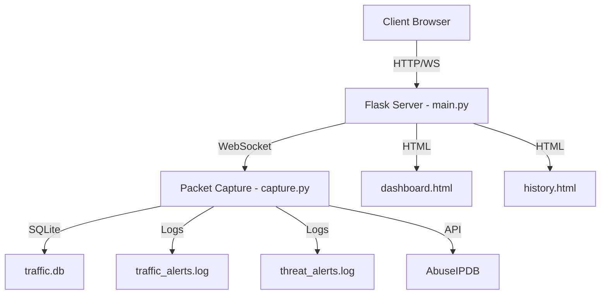
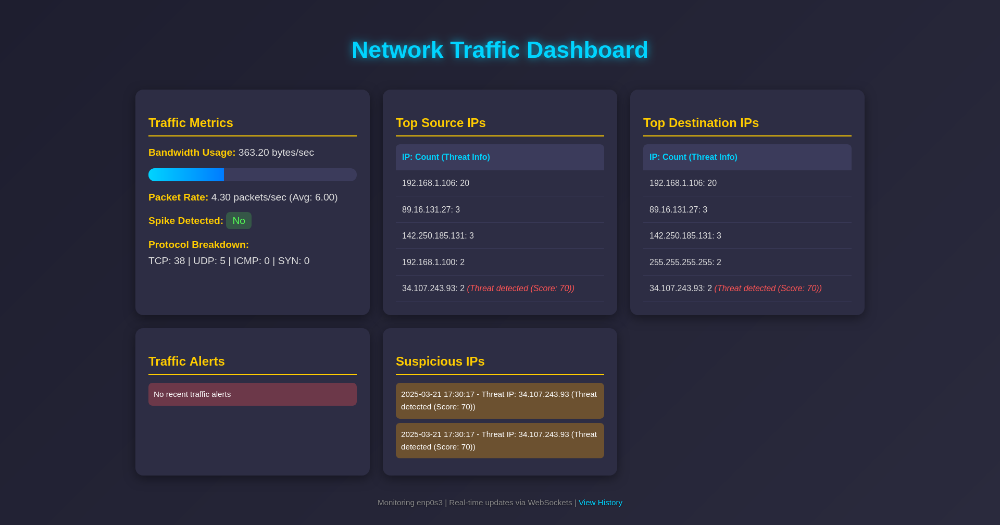
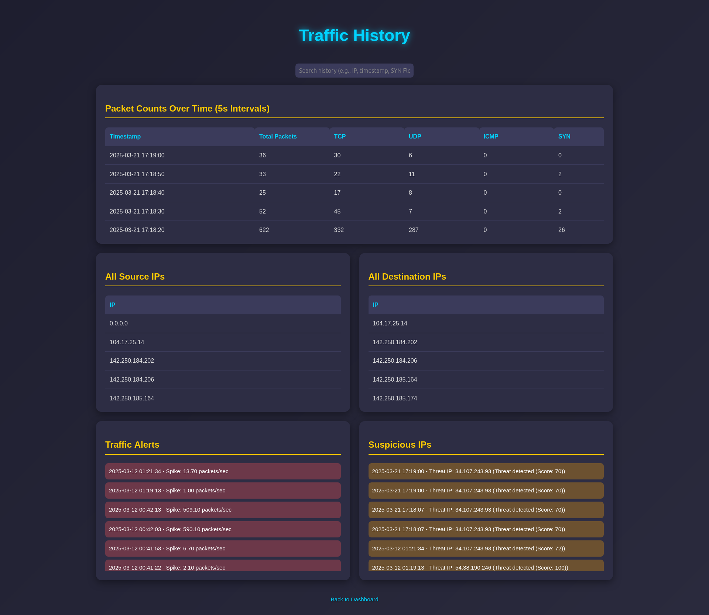
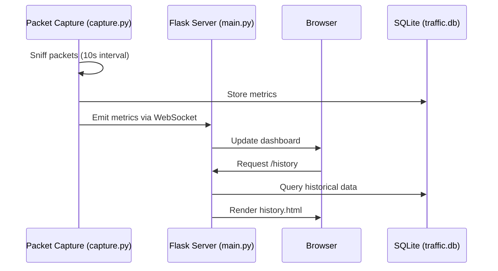

# Network Traffic Monitoring System

## Overview
The Network Traffic Monitoring System is a real-time tool designed to capture, analyze, and visualize network traffic on a specified interface. Built with Python, Flask, and WebSockets, it provides live dashboard updates and historical data analysis, making it ideal for network administrators or security researchers to detect anomalies like traffic spikes, SYN floods, and suspicious IPs.

---

## System Architecture
The system follows a modular client-server architecture with real-time communication:



1. **Backend**:
   - **Packet Capture (`capture.py`)**:
     - Uses Scapy to sniff packets on a network interface (e.g., `enp0s3`).
     - Calculates metrics (bandwidth, packet rate, protocols) every 10 seconds.
     - Detects anomalies (spikes, SYN floods, threats) and logs them.
     - Stores data in SQLite (`traffic.db`) and emits updates via WebSockets.
   - **Web Server (`main.py`)**:
     - Flask app serving two endpoints: `/` (dashboard) and `/history`.
     - Flask-SocketIO integrates WebSockets for real-time updates.
     - Runs in a threaded environment to handle capture and serving concurrently.

2. **Frontend**:
   - **Dashboard (`dashboard.html`)**:
     - Displays live metrics (bandwidth, packet rate, top IPs, alerts).
     - Updates via WebSocket events every 10 seconds without refresh.
   - **History (`history.html`)**:
     - Shows historical packet counts, IPs, and alerts in a responsive, scrollable layout.
     - Includes a search feature to filter data dynamically.

3. **Data Storage**:
   - SQLite database (`traffic.db`) stores packet counts, IPs, and alerts.
   - Log files (`traffic_alerts.log`, `threat_alerts.log`) record anomalies.

---

## Features
- **Real-Time Monitoring**:
  - Live updates of bandwidth, packet rates, protocol breakdown (TCP, UDP, ICMP, SYN), top source/destination IPs, and alerts.
  - WebSocket-based, no page refresh required.
- **Historical Analysis**:
  - Packet counts over 5-second intervals, source/destination IPs, and logged alerts.
  - Searchable interface for quick data filtering.
- **Anomaly Detection**:
  - Traffic spikes (rate > 2x average).
  - SYN floods (SYN count > 50 per interval).
  - Suspicious IPs via AbuseIPDB API (score > 50).
- **Responsive Design**:
  - Dashboard and history pages adapt to screen sizes (stack on mobile).
- **Data Persistence**:
  - SQLite for structured data, logs for alerts.

---

## System Requirements
- **Hardware**:
  - Linux system (e.g., Ubuntu) with a network interface (e.g., `enp0s3`).
- **Software**:
  - Python 3.6+ with virtualenv.
  - Dependencies: `flask`, `flask-socketio`, `scapy`, `requests`, `sqlite3`.
  - Root privileges for packet capture.
- **Network**:
  - Active interface with traffic to monitor.

---

## Installation
1. **Clone the Project**:
   ```bash
   git clone <repository-url>
   cd network_traffic
   ```

2. **Set Up Virtual Environment**:
   ```bash
   python3 -m venv venv
   source venv/bin/activate
   ```

3. **Install Dependencies**:
   ```bash
   pip install flask flask-socketio scapy requests
   ```

4. **Configure Interface**:
   - Edit `main.py` and `capture.py` to set `INTERFACE` (e.g., `enp0s3`).
   - Verify with `ip link`.

5. **Optional: AbuseIPDB API**:
   - Replace `ABUSEIPDB_API_KEY` in `capture.py` with your key for threat detection.

---

## Usage
1. **Run the Application**:
   ```bash
   sudo venv/bin/python3 main.py
   ```
   - Requires `sudo` for packet capture.
   - Outputs: Server URLs (e.g., `http://0.0.0.0:5000`).

2. **Access the Dashboard**:
   - Open `http://localhost:5000/` in a browser.
   - View live metrics and alerts.
   - 

3. **View History**:
   - Navigate to `http://localhost:5000/history`.
   - Use the search bar to filter data (e.g., “192.168”, “SYN Flood”).
   - 

4. **Generate Test Traffic**:
   - ICMP: `ping 8.8.8.8 -c 50`.
   - SYN Flood: `hping3 -S -p 80 8.8.8.8 -c 100`.

5. **Stop the Server**:
   - Press `Ctrl+C` in the terminal.

---

## Data Flow



---

## File Structure
```
network_traffic/
├── main.py              # Flask server and WebSocket setup
├── capture.py           # Packet capture and metrics logic
├── templates/
│   ├── dashboard.html   # Real-time dashboard UI
│   └── history.html     # Historical data UI
├── traffic.db           # SQLite database
├── traffic_alerts.log   # Traffic anomaly logs
└── threat_alerts.log    # Threat IP logs
└── Readme.md        # Documentation

```

---

## Database Schema
- **`packet_counts`**:
  - `timestamp TEXT`, `total_packets INTEGER`, `tcp INTEGER`, `udp INTEGER`, `icmp INTEGER`, `syn_count INTEGER`
- **`source_ips`**:
  - `ip TEXT`, `timestamp TEXT`
- **`dest_ips`**:
  - `ip TEXT`, `timestamp TEXT`
- **`traffic_alerts`**:
  - `timestamp TEXT`, `message TEXT`
- **`threat_alerts`**:
  - `timestamp TEXT`, `message TEXT`

---

## Example Output
- **Terminal**:
  ```
  Starting web server with WebSockets at http://0.0.0.0:5000
  Starting packet capture on enp0s3...
  Emitted metrics: {'bandwidth': 1254.8, 'packet_rate': 2.9, ...}
  ```
- **Dashboard**:
  - Bandwidth: “1254.80 bytes/sec”
  - Packet Rate: “2.90 packets/sec (Avg: 2.90)”
  - Alerts: “2025-03-12 00:35:45 - Spike: 2.90 packets/sec”
  
- **History**:

  
  - Packet Counts: “2025-03-12 00:35:45 | 29 | 0 | 27 | 0 | 0”

---

## Limitations
- **Capture Interval**: Fixed at 10 seconds—may miss micro-bursts.
- **Local Traffic**: Threat detection skips private IPs (e.g., `192.168.x.x`).
- **Performance**: High traffic volumes may strain CPU/memory without optimization.

---

## Future Enhancements
- **Dynamic Intervals**: Adjustable capture frequency.
- **Visualizations**: Charts for bandwidth or packet trends (e.g., Chart.js).
- **Notifications**: Email or desktop alerts for anomalies.
- **Export**: Download data as CSV/PDF.

---

## Conclusion
This system provides a robust foundation for network monitoring, combining real-time insights with historical analysis. It’s extensible for advanced features and serves as a practical tool for studying network behavior.

---
